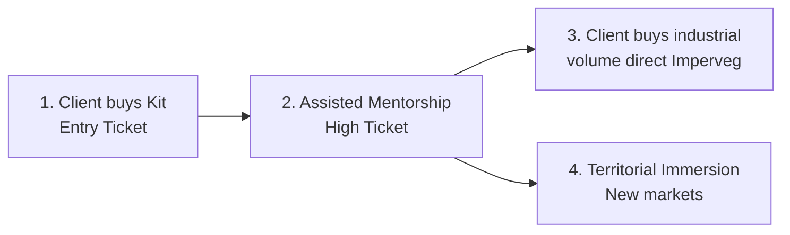

# Commercial Proposal: Takwara & Imperveg

**Bio-Solder Kit — From B2C to B2B**

---

## 1. Market Opportunity

Takwara Technology has consolidated the perfect synergy between natural bamboo fiber and Imperveg's Castor Oil Vegetable Polyurethane.

**Strategic timing:** Recent academic publications, brand expansion (Tecnoveg plant in Portugal), and global demand for non-toxic materials create a perfect window to reintroduce the educational kit model.

**Absolute Competitive Advantage:** The market is hungry for real sustainability. Imperveg's product is technologically superior because it **contains no traces of isocyanate in the pure catalyst**. A huge latent demand exists from Eco-Architects and Makers barred from Imperveg's PU by the industrial drum barrier.

**Core argument:** The educational kit, paired with mentorship, is a customer-funded testing laboratory. The artisan who tests today is the contractor ordering industrial volumes tomorrow.

## 2. The Solution: Bio-Solder Kit

### Physical Product (Entry Pack)

"Botanical Alchemy" packaging:

| Item | Specification |
|---|---|
| Imperveg PU Vegetal | Fractionated: 2–3 kg |
| Veterinary syringe | 150 ml (nodular injection) |
| Silicone brush | Manual application |
| Nitrile gloves | Safety |
| Specific-grit sandpaper | Surface preparation |
| **QR Code** | → Mentorship Platform access |

### The Digital Key

Inside the box, a QR Code leads to the Takwara Platform, where Researcher Fábio Takwara teaches stoichiometry (pot-life), surface preparation, and safe injection techniques.

## 3. Ascension Funnel

1. **First Contact:** Client buys Kit online for small projects
2. **Assisted Mentorship:** Client decides to build → Takwara sells project mentorship. At this point, client buys **industrial volumes directly from Imperveg (B2B)**
3. **Territorial Immersion:** Fábio visits the community and installs knowledge on-site, opening new distribution territories

## 4. Operational Models

| Scenario | Description |
|---|---|
| **A — Takwara Centralized** | Imperveg supplies fractionated bulk → Takwara assembles premium box + ships |
| **B — Dropshipping** | Takwara sells pack → Ships accessories → Dispatches PU order to Imperveg (direct shipping with invoice) |
| **C — Affiliate** | Takwara sells mentorship + accessories → Student buys resin via commissioned Imperveg link |

## 5. Funding Requests

1. **Inaugural Donation:** Initial batch of 50–100 fractionated kits for customer acquisition
2. **Extended Grace:** Extended payment terms for the first chemical lot

## 6. Next Steps

- Live demonstration at Takwara workshop
- **Hortitec 2027** — Joint booth in Holambra
- Strategic visit to the 2026 edition

---

*Confidential document — Takwara & Imperveg*
