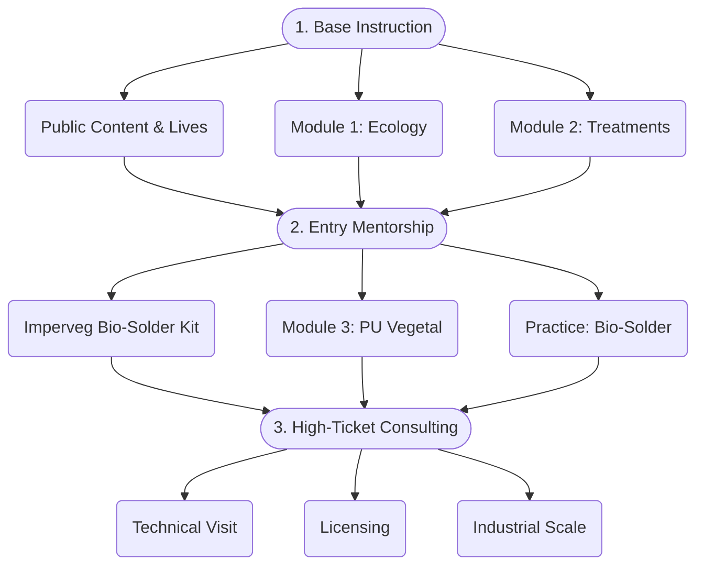

# 🌿 Tecnologia Takwara

**Mentorship in Bamboo Engineering & Vegetable Polyurethane**

---

Welcome to the knowledge platform of **Tecnologia Takwara** — a Brazilian grassroots innovation uniting ancestral ecology and materials engineering to transform bioconstruction.

## Our Technology

- **Ecological bamboo treatment** — poison-free (no CCA/CCB/Boron). Closed-cycle furnaces with steam + pyroligneous acid + ash milk.
- **Castor Oil Vegetable Polyurethane** — non-toxic, biocompatible (used in cranial prostheses), MS 888 certified for drinking water.
- **T-Series equipment** — patents filed (DOI: 10.5281/zenodo.18827106).

## The Mentorship Funnel

## Browse the sidebar

Explore the **Knowledge Base** to dive into technical fundamentals, or follow the **7-Step Journey** to structure your technological autonomy.
