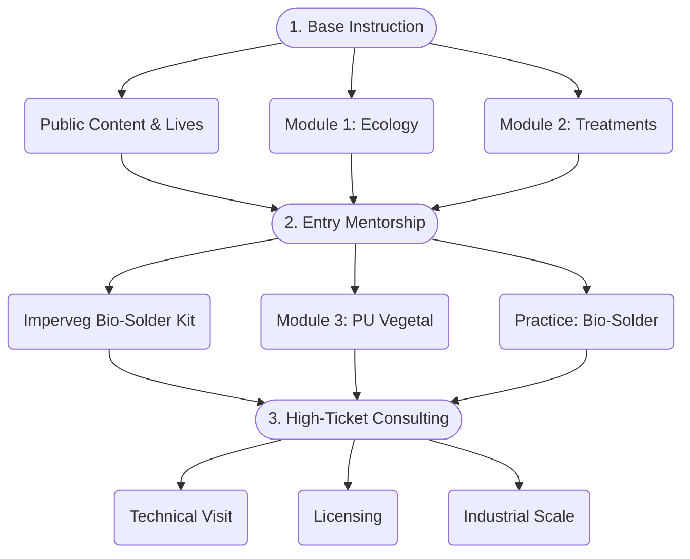

# 🌱 7-Step Journey

**The path from discovery to technological autonomy.**

---

Tecnologia Takwara is a Brazilian grassroots innovation, validated by 15 years of prototyping and recognized by the Nature Awards curation. This 7-step journey was designed to transform ancestral knowledge of bamboo and vegetable polyurethane into cutting-edge technology, backed by scientific research, laboratory testing (Itecons), and innovation prospects for Amazonian bioeconomy and sustainable construction.

## The Mentorship Funnel

## The 7 Steps

| Step | Title | What you'll find |
|:-----|:------|:-----------------|
| **Step 1** | [Persona Diagnosis](/en/jornada/passo-01) | Identify your profile (4 personas), qualification matrix, and personalized direction |
| **Step 2** | [Transformation Map](/en/jornada/passo-02) | From Point A to Point Z: where you are, where you're going, and the macro steps of learning |
| **Step 3** | [Structure & Format](/en/jornada/passo-03) | 3-level funnel, 6 mentorship modules, launch calendar, and touchpoints |
| **Step 4** | Accelerators | Tools and checklists to overcome the most common roadblocks in your journey |
| **Step 5** | Pricing | Pricing models and investment definition for each funnel level |
| **Step 6** | Name & Promise | Brand definition, positioning, and value promise of the mentorship |
| **Step 7** | Sales Immersion | Launch strategies, distribution channels, and conversion |

## Browse the Steps

- **Step 1 →** [Persona Diagnosis](/en/jornada/passo-01) — Discover your profile and how Takwara can help you
- **Step 2 →** [Transformation Map](/en/jornada/passo-02) — Visualize the complete learning path
- **Step 3 →** [Structure & Format](/en/jornada/passo-03) — Explore the funnel, modules, and calendar
