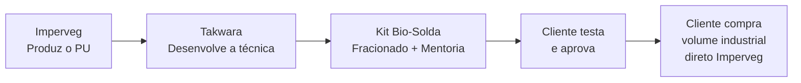

# Imperveg — Poliuretano Vegetal de Alta Performance

## Sobre a Imperveg

**Imperveg Polímeros Vegetais** é uma empresa brasileira fundada em **2008** em Aguaí-SP, por dois irmãos empreendedores que buscavam alternativas sustentáveis para a indústria de impermeabilização.

| Indicador | Dado |
|---|---|
| Fundação | 2008 |
| Sede | Aguaí, SP — Brasil |
| Matéria-prima | Óleo de Mamona (Ricinus Communis) |
| Clientes | 500+ em 8 países |
| Área aplicada | 1.000.000+ m² |
| Status 2025 | Multinacional (filial Tecnoveg em Portugal) |

## Produto Estrela: PU Vegetal

O Poliuretano Vegetal Imperveg é um polímero 100% sólido, isento de solventes, derivado do óleo de mamona. Suas características únicas incluem:

- **Atóxico:** Não libera VOCs durante a cura. Seguro para aplicação em ambientes confinados.
- **Biocompatível:** Mesmo material usado em próteses cranianas (InCor/FMUSP).
- **Certificado MS 888:** Apto para contato com água potável.
- **Alta performance:** 1,8 MPa de aderência (Pull-Off), 365m de barreira ao CO₂.

### Linhas Principais

| Produto | Aplicação |
|---|---|
| **RQI 132 M** | Concreto, impermeabilização, ETEs, reservatórios |
| **RQI 132 MR** | Reservatórios de água potável (MS 888) |
| **UG 132** | Madeira, bambu, EPS, tecidos |
| **AGT 1315** | Matriz aglomerante para compósitos |

## Parceria Takwara + Imperveg

A Tecnologia Takwara utiliza o PU Vegetal Imperveg como **Bio-Solda** — o adesivo estrutural que conecta as fibras de bambu em substituição a epóxis tóxicos e conexões metálicas.

O **Kit Bio-Solda** (PU fracionado + seringa + acessórios) é a porta de entrada da mentoria, permitindo que makers, arquitetos e comunidades experimentem a tecnologia antes de escalar para volumes industriais.

[→ Ver Proposta Comercial Detalhada](/imperveg/proposta)
