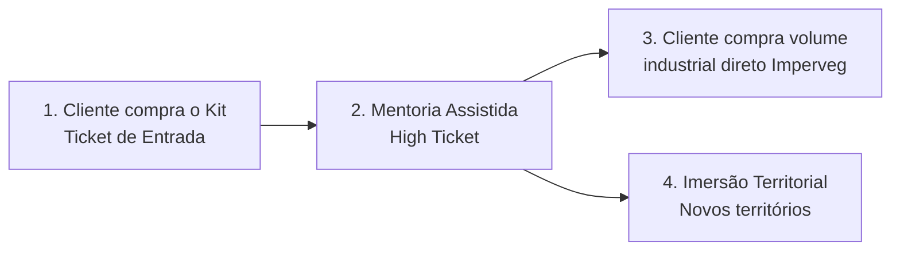

# Proposta de Parceria: Takwara & Imperveg

**Kit Bio-Solda — Do B2C ao B2B**

---

## 1. Oportunidade de Mercado

A Tecnologia Takwara consolidou ao longo dos anos a sinergia perfeita entre a fibra natural (bambu) e o Poliuretano Vegetal de Mamona fabricado pela Imperveg.

**Momento estratégico:** Com os recentes estudos acadêmicos publicados, a expansão da marca (nova planta Tecnoveg em Portugal) e a demanda global por materiais não-tóxicos, a volta dos "Kits Casados" a uma plataforma educacional fortalecerá o interesse global pelo material.

**Vantagem Competitiva Absoluta:** O mercado está sedento por sustentabilidade real. O produto Imperveg é tecnologicamente superior porque **não contém traços de isocianato no catalisador puro**. Existe uma demanda reprimida de Arquitetos Ecológicos e Makers que desejam abandonar venenos (CCA/CCB), mas não conseguem acessar o PU Imperveg pela barreira do fracionamento (tambores industriais).

**Argumento central:** O Kit Caseiro, atrelado a uma Mentoria, é um laboratório de testes financiado pelo cliente. O artesão que testa e aprova o kit hoje é o empreiteiro que fará pedidos em larga escala amanhã.

## 2. A Solução: Kit Bio-Solda

### O Produto de Entrada (Kit Físico)

Caixa com estética de "Alquimia Botânica":

| Item | Especificação |
|---|---|
| PU Vegetal Imperveg | Fracionado: 2–3 kg |
| Seringa veterinária | 150 ml (injeção nodular) |
| Pincel de silicone | Para aplicação manual |
| Luvas nitrílicas | Segurança |
| Lixa de grão específico | Preparação de superfície |
| **QR Code** | → Acesso à Plataforma de Mentoria |

### A Chave Digital

Dentro da caixa, o cliente encontra um QR Code que o direciona para a Plataforma Takwara. Lá, o Pesquisador Fábio Takwara ensina virtualmente a dominar a estequiometria (pot-life), a preparação da superfície e a injeção segura.

## 3. Funil de Ascensão

1. **Primeiro Contato:** Cliente compra o Kit online para treinar em pequenos projetos
2. **Mentoria Assistida:** Cliente decide construir — Takwara vende mentoria de projeto. Neste ponto, o cliente fará a **compra direta com a Imperveg de volumes industriais (B2B)**
3. **Imersão Territorial:** Fábio vai até a comunidade e instala o conhecimento presencialmente, abrindo novos territórios de distribuição

## 4. Modelos Operacionais

| Cenário | Descrição |
|---|---|
| **A — Centralizado Takwara** | Imperveg fornece fracionados no atacado → Takwara monta a caixa premium e despacha |
| **B — Dropshipping** | Takwara vende o pacote → Envia acessórios → Dispara pedido de PU para Imperveg (envio direto com NF) |
| **C — Afiliado** | Takwara vende mentoria + acessórios → Aluno compra resina via link comissionado da loja Imperveg |

## 5. Contrapartidas

Para viabilizar o lançamento, solicitamos:

1. **Doação Inaugural:** Lote inicial de 50–100 kits fracionados para aquisição de clientes e geração de provas sociais
2. **Carência Estendida:** Prazo estendido para pagamento do primeiro lote químico

## 6. Próximos Passos

- Demonstração prática na oficina Takwara
- **Hortitec 2027** — Estande conjunto em Holambra
- Visita prévia à edição 2026

---

*Documento confidencial — Takwara & Imperveg*
