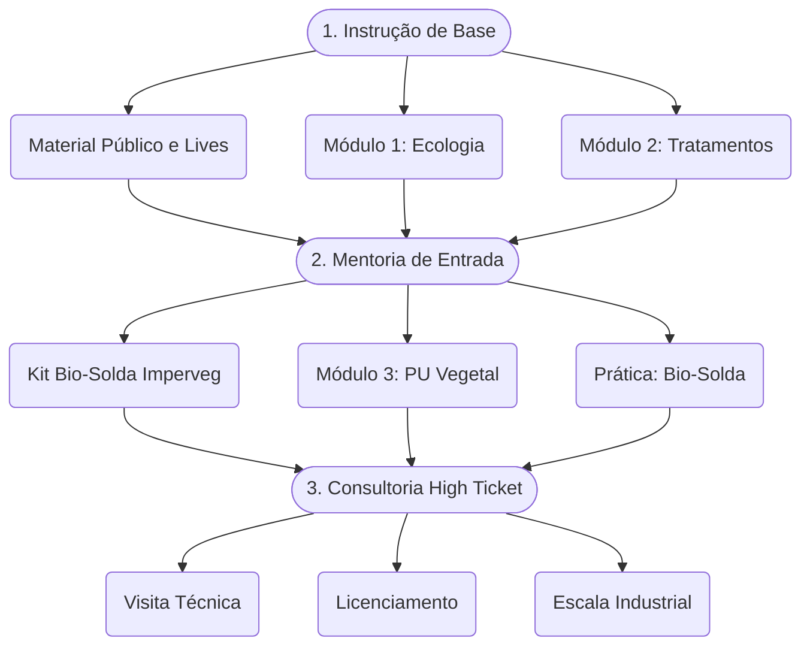

# 🌿 Tecnologia Takwara

**Mentoria em Engenharia de Bambu e Poliuretano Vegetal**

---

Bem-vindo à plataforma de conhecimento da **Tecnologia Takwara** — uma inovação de base brasileira que une ecologia ancestral e engenharia de materiais para transformar a bioconstrução.

## Nossa Tecnologia

- **Tratamento ecológico do bambu** — sem venenos (CCA/CCB/Bórax). Fornos de ciclo fechado com vapor + pirolenhoso + leite de cinzas.
- **Poliuretano Vegetal de Mamona** — atóxico, biocompatível (uso em próteses cranianas), certificado MS 888 para água potável.
- **Série T de equipamentos** — patentes depositadas (DOI: 10.5281/zenodo.18827106).

## O Funil da Mentoria

## Navegue pelo menu lateral

Explore a **Base de Conhecimento** para mergulhar nos fundamentos técnicos, ou siga a **Jornada de 7 Passos** para estruturar sua autonomia tecnológica.
