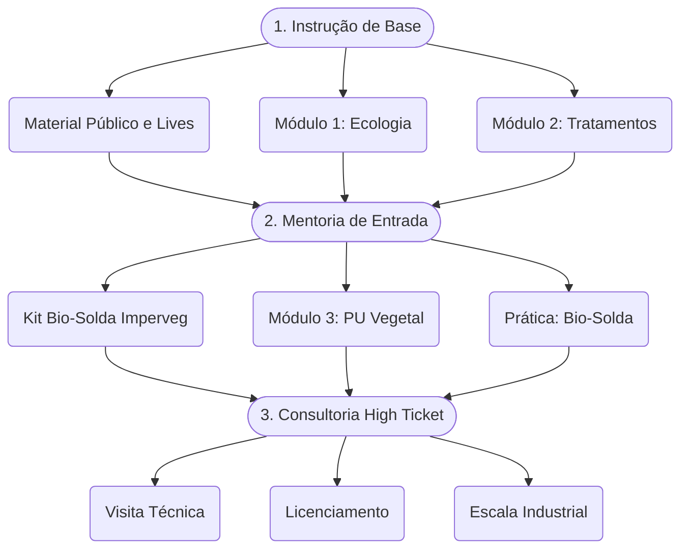

# 🌱 Jornada de 7 Passos

**O caminho da descoberta à autonomia tecnológica.**

---

A Tecnologia Takwara é uma inovação de base brasileira, validada por 15 anos de prototipagem e por elogios da curadoria do Nature Awards. Esta jornada de 7 passos foi desenhada para transformar o conhecimento ancestral do bambu e do poliuretano vegetal em tecnologia de ponta, com respaldo científico, ensaios laboratoriais e prospecções de inovação para a bioeconomia amazônica e a construção sustentável.

## O Funil da Mentoria

## Os 7 Passos

| Passo | Título | O que você vai encontrar |
|:------|:-------|:-------------------------|
| **Passo 1** | [Diagnóstico de Persona](/jornada/passo-01) | Identificação do seu perfil (4 personas), matriz de qualificação e direcionamento personalizado |
| **Passo 2** | [Mapa da Transformação](/jornada/passo-02) | Do Ponto A ao Ponto Z: onde você está, para onde vai, e os macropassos do aprendizado |
| **Passo 3** | [Estrutura e Formato](/jornada/passo-03) | Funil de 3 níveis, 6 módulos da mentoria, calendário de lançamento e pontos de contato |
| **Passo 4** | Aceleradores | Ferramentas e checklists para superar as travas mais comuns na sua jornada |
| **Passo 5** | Precificação | Modelos de precificação e definição de investimento para cada nível do funil |
| **Passo 6** | Nome e Promessa | Definição da marca, posicionamento e promessa de valor da mentoria |
| **Passo 7** | Imersão em Vendas | Estratégias de lançamento, canais de distribuição e conversão |

## Navegue pelos Passos

- **Passo 1 →** [Diagnóstico de Persona](/jornada/passo-01) — Descubra seu perfil e como a Takwara pode te ajudar
- **Passo 2 →** [Mapa da Transformação](/jornada/passo-02) — Visualize o caminho completo do aprendizado
- **Passo 3 →** [Estrutura e Formato](/jornada/passo-03) — Conheça o funil, os módulos e o calendário
